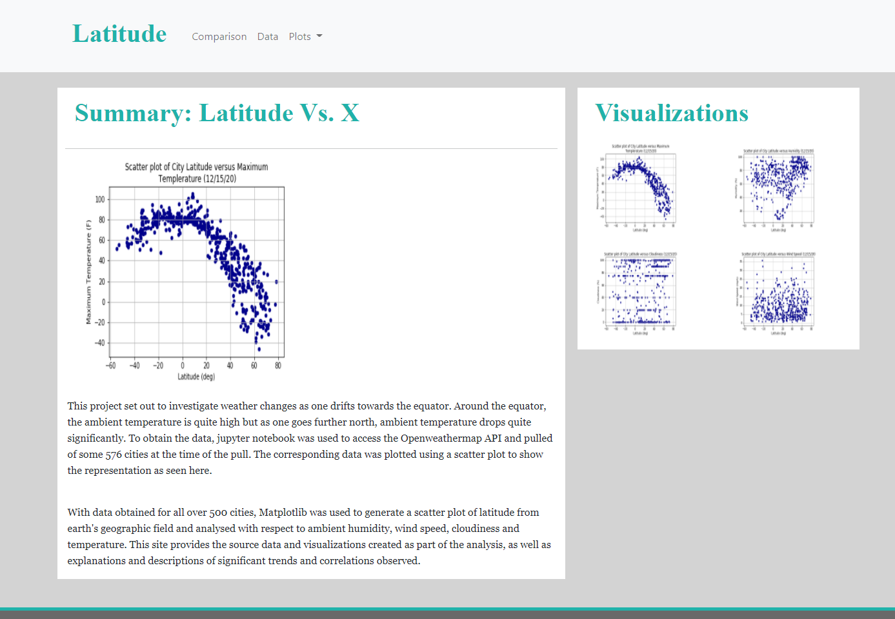
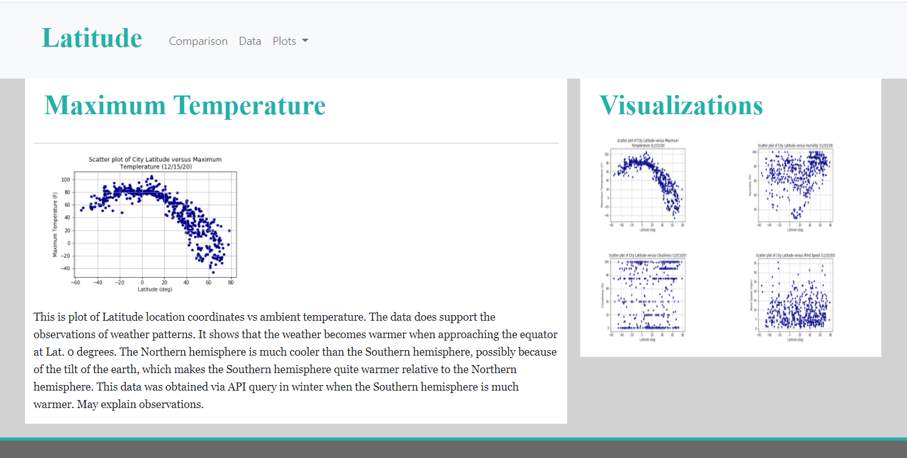
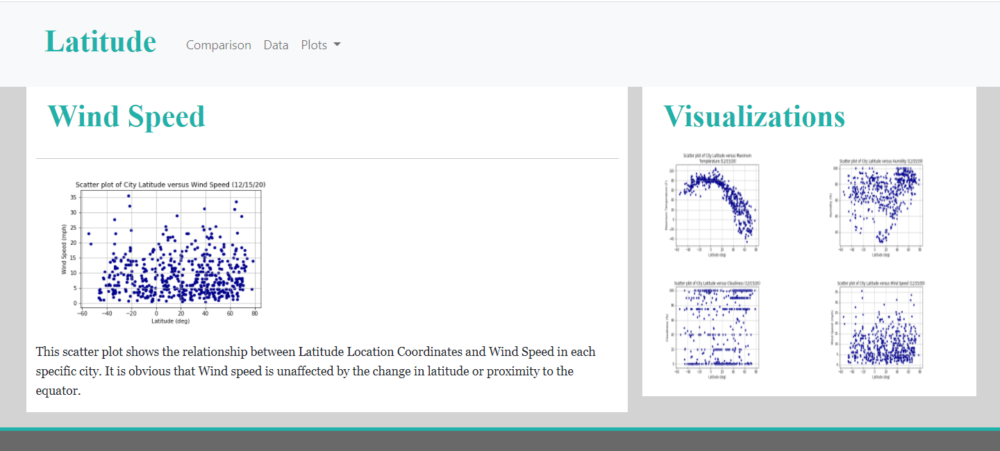
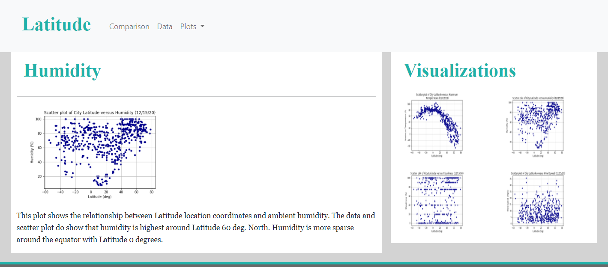
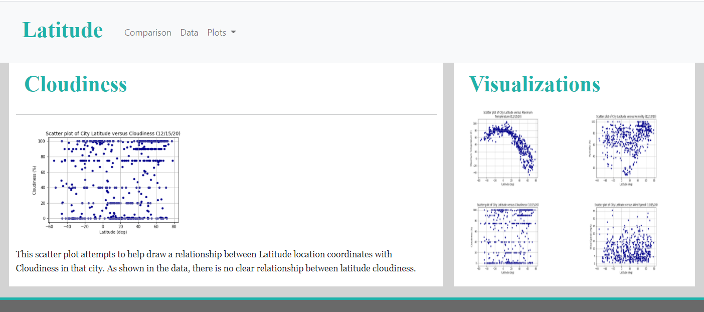
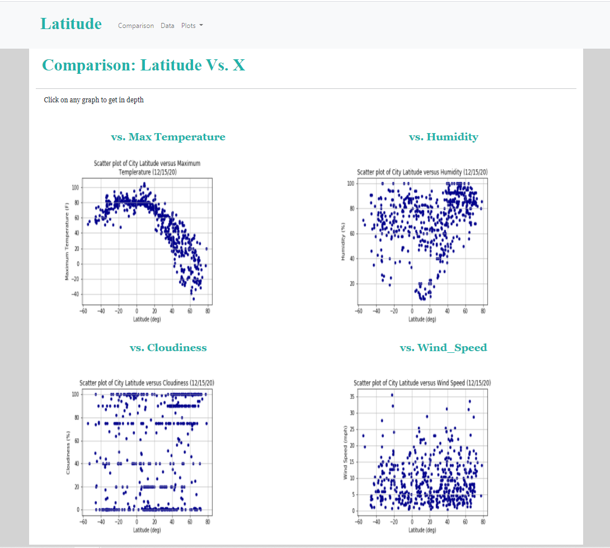

# Web-Design-Challenge

Web Design Challenge

Data has the best meaning when it can be put in pictures or visualized. It is even more powerful when it can be shared with others who can comprehend its meaning. Putting together the many and varied tools that make this possible is a rigorous but rewarding experience. This challenge built on a previous challenge by using new knowledge about HTML and CSS to create a webpage that is published to present visuals of some weather data analysis. The resulting webpage can be found here: https://jonathanezeugo.github.io/Web-Design-Challenge/

Background

From a previous challenge on weather, python and API queries helped retrieve weather data of over 500 cities around the world. A series of scatter plots were made to showcase the relationship between latitude locations and certain weather parameters, namely:

1. Temperature (F) vs. Latitude
2. Humidity (%) vs. Latitude
3. Cloudiness (%) vs. Latitude
4. Wind Speed (mph) vs. Latitude

The four scatter plots generated from this weather analysis is now published on a webpage using html and css tools. The key question these plots help to answer is: "What is the weather like as we approach the equator?" The visualizations on each webpage helps to provide logical answers based on the plots generated using the data obtained. The data file contrived from the API queries on python used city position coordinates to obtain city locations and weather data. The pages generated for the webpage are:

1. The Landing Page
    This is the first page that the website shows to the viewer. It gives a summary visualization of the essense for the weather analysis. It also links to the other visualizations pages. There is also a side bar showing the preview images of each plot. Clicking the image takes the webpage visitor to that specific visualization. https://jonathanezeugo.github.io/Web-Design-Challenge/
    

2. Four Visualizaton plots consisting of:
    - Latitude vs Maximum temperature page: This page shows the scatter plot defining the relationship between the ambient temperature and latitude location on when each specific city is. Find the page here: https://jonathanezeugo.github.io/Web-Design-Challenge/Visualizations/temp.html

    - Latitude vs Wind Speed Visualizaton Page: This page shows the scatter plot for the relationship between latitude of a city and the wind speed. It shows there is no clear relationship to correlate both. Find it here: https://jonathanezeugo.github.io/Web-Design-Challenge/Visualizations/wind.html

    - Latitude vs Humidity page: This shows the scatter plot defining the relationship between the ambient humidity and latitude location for each city. Find the page here: https://jonathanezeugo.github.io/Web-Design-Challenge/Visualizations/humidity.html

 
    - Latitude vs Cloudiness page: This page shows the scatter plot drawing a relationship between cloudiness of a city and latitude location of the city. Here's the page: https://jonathanezeugo.github.io/Web-Design-Challenge/Visualizations/cloudiness.html

    

3. A Comparisons Page:
    This contains all four visualizations across on screens medium and large for each view and analysis. Here's the page: https://jonathanezeugo.github.io/Web-Design-Challenge/comparison.html

    

4. A Data page:
    This is a portrayal of the queried data from which the scatter plots were generated. It was first a csv file but then converted to a html file for webpage casting. Here's the Data page:
    https://jonathanezeugo.github.io/Web-Design-Challenge/data.html
    
Bootstrap website provided the source codes that were used to cast the images to the website. 
